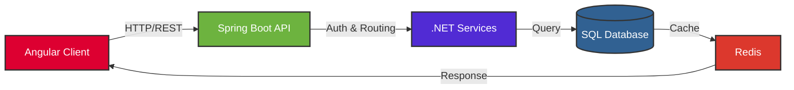

  

  

  

## About me 

<table>
<tr>
<td valign="top"></td>
<td valign="top"></td>
</tr>
</table>

I'm a **Backend Engineer** who builds robust, scalable services — from REST APIs in Spring Boot and .NET to the databases and data pipelines that power them. I'm just as comfortable writing Java and C# on the server as I am wiring up an Angular front end to consume it.

- 🔭 I'm currently pursuing my **MS in Information Systems** at Northeastern University
- 🌱 I'm sharpening my backend chops with **Spring Boot**, **C#/.NET**, and **relational database design**
- 👨‍💻 All of my projects are available on [GitHub](https://github.com/DurgeshS-25)
- 📫 How to reach me: **sakhardande.d@northeastern.edu**
- 🌟 Fun fact: give me a well-normalized schema and a clean API contract and I'm happy

## 💻 Tech Stack 

  <code></code>
  <code></code>
  <code></code>
  <code></code>
  <code></code>
  <code></code>
  <code></code>

### 🛠️ Languages and Tools

  <table>
    <tr>
      <td valign="top" width="33%">
        <h3 align="center">Backend & Languages</h3>
        

          
          
          
          
          
          
        

      </td>
      <td valign="top" width="33%">
        <h3 align="center">Databases</h3>
        

          
          
          
          
          
        

      </td>
      <td valign="top" width="33%">
        <h3 align="center">Frontend & Tools</h3>
        

          
          
          
          
          
        

      </td>
    </tr>
  </table>

### 📊 Backend Request Flow

## 🌟 Highlighted Projects

<table>
<tr>
<td width="50%" valign="top">
  <h3><a href="https://github.com/DurgeshS-25/Adventure-works-Piepline">Adventure-works-Piepline</a></h3>
  
End-to-end data pipeline built on the classic Adventure Works dataset.

</td>
<td width="50%" valign="top">
  <h3><a href="https://github.com/DurgeshS-25/Reddit-Pipeline">Reddit-Pipeline</a></h3>
  
Data pipeline that ingests and processes Reddit data.

</td>
</tr>
<tr>
<td width="50%" valign="top">
  <h3><a href="https://github.com/DurgeshS-25/Urban-Traffic-Collision-Pipeline">Urban-Traffic-Collision-Pipeline</a></h3>
  
Pipeline analyzing urban traffic collision data.

</td>
<td width="50%" valign="top">
  <h3><a href="https://github.com/shalakapadalkar16/Intelligent-Research-Assistant">Intelligent-Research-Assistant</a></h3>
  
Collaborative project on an AI-powered research assistant.

</td>
</tr>
</table>

## 📚 Education & Certifications

  <!-- AWS Certification -->
  

    
    <h3>AWS Certified Cloud Practitioner</h3>
    
Amazon Web Services • 2024

  

  
   
  
  <!-- Education with repository images -->
  <table border="0">
    <tr>
      <td width="50%" align="center">
        <!-- Northeastern University using repo image -->
        
          
        <h3>Master of Science in Information Systems</h3>
        
Northeastern University • 2023-2025

      </td>
      <td width="50%" align="center">
        <!-- University of Mumbai using repo image -->
        
          
        <h3>Bachelor of Science in Electronics and Telecommunication Engineering</h3>
        
University of Mumbai • 2018-2022

      </td>
    </tr>
  </table>

## 📊 GitHub Analytics

<!-- Self-rendered, self-hosted stats + top languages (no external stats service) -->

  

  

<!-- Self-rendered, self-hosted living terminal contribution graph -->

  <h3><code> Contributions.log</code></h3>
  

## 🚀 Current Focus

- Designing REST APIs and microservices with Spring Boot and .NET
- Sharpening database design and query performance across SQL and NoSQL stores
- Building Angular front ends that talk cleanly to those backends
- Contributing to open-source backend and full-stack projects

  <h3>Let's connect and build something amazing together!</h3>
  
"The goal is to turn data into information, and information into insight." - Carly Fiorina

