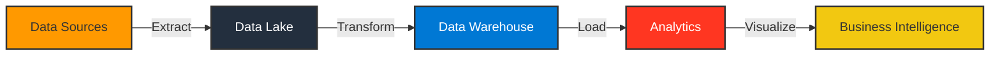

  

  

  

  

## 👨‍💻 About Me

I'm a **Software Engineer** specializing in cloud-based data solutions with expertise across AWS and Azure platforms. My passion lies in architecting end-to-end data pipelines that transform raw information into actionable business intelligence.

- 🔭 I'm currently pursuing my **MS in Information Systems** at Northeastern University
- 🌱 I'm exploring **Streaming Data Architectures** and **MLOps Pipelines**
- 👨‍💻 All of my projects are available on [GitHub](https://github.com/DurgeshS-25)
- 📫 How to reach me: **sakhardande.d@northeastern.edu**
- 🌟 Fun fact: I believe data is like a puzzle - the real magic happens when you connect all the pieces!

## 💻 Tech Stack 

  <code></code>
  <code></code>
  <code></code>
  <code></code>
  <code></code>
  <code></code>

### 🛠️ Languages and Tools

  <table>
    <tr>
      <td valign="top" width="33%">
        <h3 align="center">Cloud & Data</h3>
        

          
          
          
          
          
          
        

      </td>
      <td valign="top" width="33%">
        <h3 align="center">Databases</h3>
        

          
          
          
          
          
        

      </td>
      <td valign="top" width="33%">
        <h3 align="center">Visualization & Tools</h3>
        

          
          
          
          
          
        

      </td>
    </tr>
  </table>

### 📊 Data Engineering Pipeline

## 🌟 Highlighted Projects

  <!-- First row of projects -->
  
  

 

  <!-- Second row of projects -->
  
  

## 📚 Education & Certifications

  <!-- AWS Certification -->
  

    
    <h3>AWS Certified Cloud Practitioner</h3>
    
Amazon Web Services • 2024

  

  
   
  
  <!-- Education with repository images -->
  <table border="0">
    <tr>
      <td width="50%" align="center">
        <!-- Northeastern University using repo image -->
        
          
        <h3>Master of Science in Information Systems</h3>
        
Northeastern University • 2023-2025

      </td>
      <td width="50%" align="center">
        <!-- University of Mumbai using repo image -->
        
          
        <h3>Bachelor of Science in Electronics and Telecommunication Engineering</h3>
        
University of Mumbai • 2018-2022

      </td>
    </tr>
  </table>

## 📊 GitHub Analytics

  

  

## 🚀 Current Focus

- Building modern data mesh architectures
- Exploring real-time analytics with Kafka and Spark Streaming
- Implementing MLOps pipelines with Kubeflow
- Contributing to open-source data engineering projects

  <h3>Let's connect and build something amazing together!</h3>
  
"The goal is to turn data into information, and information into insight." - Carly Fiorina

